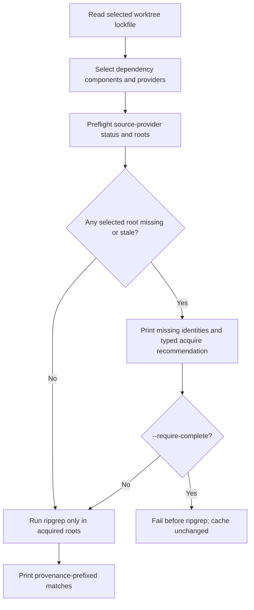

# Dependency and Source Workflow

SFM's schema-v3 lockfile is the source of truth for the dependencies used by a
Minecraft-version worktree and for the exact source payloads that can be
searched. This guide explains how to inspect those declarations, acquire
authoritative Minecraft or mod sources, and search them without an accidental
network fetch.

Commands below use the installed executable. When changing the Rust CLI itself,
run the equivalent command as `cargo run -- ...` from
`platform/cli/sfm-propagate-changes` so validation uses the current source
tree.

## Core rules

1. Always provide `--branch <Minecraft version>`. The CLI resolves it to one
   SFM worktree and reads that worktree's
   `platform/minecraft/sfm-toolchain.lock.json`.
2. Work on the oldest version that needs a change, normally `1.19.2`. Do not
   edit a later worktree's dependency declaration to solve an earlier-version
   problem; use `sfm-propagate-changes.exe git merge` after the oldest branch
   passes its gates.
3. The v3 lockfile contains maintained dependency declarations and generated
   resolution checks. Gradle consumes that lockfile for its active
   ForgeGradle/NeoGradle dialect. Do not create a second handwritten dependency
   source of truth in Gradle.
4. Binary artifacts and materialized source trees are cache state, not
   repository files. The portable `$sfm-cache` paths in a lockfile must never
   be replaced by a local absolute path.
5. Source acquisition is explicit. `dependency source search` never downloads,
   decompiles, extracts, or otherwise materializes sources.

## Command side effects at a glance

| Command | Reads lockfile | Network / source generation | Writes cache | Changes lockfile |
| --- | --- | --- | --- | --- |
| `dependency list` / `dependency show` | Yes | No | No | No |
| `dependency source provider list` | Yes | No | No | No |
| `dependency source search` | Yes | No | No | No |
| `dependency source acquire` | Yes | When the selected locked provider needs it | Yes | No |
| dependency mutation commands such as `add`, `remove`, `refresh`, or `artifact accept` | Yes | As required by the command | As required | Yes |

The first three rows are safe ways to inspect the current dependency and source
state. Source acquisition acts only on already locked metadata: it is not a
dependency upgrade or a lockfile mutation.

## Inspect a dependency before acquiring anything

Start with the logical dependency and its provider declarations:

```pwsh
sfm-propagate-changes.exe dependency list --branch 1.19.2
sfm-propagate-changes.exe dependency show minecraft --branch 1.19.2
sfm-propagate-changes.exe dependency source provider list minecraft --branch 1.19.2

sfm-propagate-changes.exe dependency show cc-tweaked --branch 1.19.2
sfm-propagate-changes.exe dependency source provider list cc-tweaked --branch 1.19.2
```

`dependency show` explains a dependency's components, semantic scopes, locked
artifact identity, and source-provider state. `provider list` is the concise
decision view: it reports each component/provider identity, provider kind,
priority, whether `any` selects it, source status, and any materialized roots.

Use a target in the form `dependency` when it has one component, or
`dependency/component` when it has more than one. The CLI rejects an ambiguous
bare dependency target rather than guessing a component.

Provider kinds are:

- `platform-pipeline` — the selected Minecraft/loader source pipeline.
- `git` — an exact locked upstream revision acquired into SFM's managed Git
  cache using `gix` rather than a user clone or `git.exe`.
- `maven-sources` — the exact locked Maven sources archive, extracted as a
  source payload and kept separate from build classpaths.
- `decompile` — a locked standalone decompiler output when no source archive
  or upstream source tree is the selected provider.
- `any` — the first matching declared provider, by the lockfile's priority.

Use `--provider-id <id>` only after `provider list` shows a particular stable
provider ID you need. It selects that provider instead of selecting by kind.
Do not combine `--provider` and `--provider-id`.

## Acquire Minecraft sources

Minecraft source is not treated as an ordinary Maven `sources` JAR. It is
produced by the version/loader-specific platform pipeline recorded in the
selected worktree's lockfile. On the 1.19.2 Forge worktree, acquire it with:

```pwsh
sfm-propagate-changes.exe dependency source acquire minecraft --provider platform-pipeline --branch 1.19.2
```

Then search only the platform source root:

```pwsh
sfm-propagate-changes.exe dependency source search 'GameTestHelper' `
  --dependency minecraft `
  --provider platform-pipeline `
  --require-complete `
  --branch 1.19.2
```

The materialized source form and its location are an implementation detail of
the active platform pipeline. Use `dependency show minecraft` or `provider
list minecraft` to inspect the exact root; do not hard-code a build-directory
path or assume that another Minecraft version uses the 1.19.2 Forge pipeline.

The same command shape works on later worktrees, but the branch selects the
correct ForgeGradle or NeoGradle source pipeline:

```pwsh
sfm-propagate-changes.exe dependency source acquire minecraft --provider platform-pipeline --branch 1.20.2
```

## Acquire and search a mod's sources

Mods can expose one or more provider choices. CC:Tweaked on 1.19.2 deliberately
locks an upstream Git tree first and a Maven `sources` archive as a fallback.

Inspect the choices, then acquire the exact one needed for the question:

```pwsh
sfm-propagate-changes.exe dependency source provider list cc-tweaked --branch 1.19.2

# Locked upstream tree, at the exact tag/commit from the lockfile.
sfm-propagate-changes.exe dependency source acquire cc-tweaked --provider git --branch 1.19.2

# Published API source archive, when that is the more useful representation.
sfm-propagate-changes.exe dependency source acquire cc-tweaked --provider maven-sources --branch 1.19.2
```

Search the same provider that you acquired when you need one authoritative
view of a declaration:

```pwsh
sfm-propagate-changes.exe dependency source search 'IPeripheralProvider' `
  --dependency cc-tweaked `
  --provider git `
  --require-complete `
  --branch 1.19.2

sfm-propagate-changes.exe dependency source search 'ComputerCraftAPI' `
  --dependency cc-tweaked `
  --provider maven-sources `
  --require-complete `
  --branch 1.19.2
```

If source provenance is not important for a quick investigation, `--provider
any` acquires the first declared provider for that component. On the 1.19.2
CC:Tweaked lock entry, that is the Git provider:

```pwsh
sfm-propagate-changes.exe dependency source acquire cc-tweaked --provider any --branch 1.19.2
```

For comparison work across more than one mod, repeat `--dependency`. Acquire
each source tree first, then require a complete search:

```pwsh
sfm-propagate-changes.exe dependency source acquire mekanism --provider any --branch 1.19.2
sfm-propagate-changes.exe dependency source acquire cc-tweaked --provider any --branch 1.19.2
sfm-propagate-changes.exe dependency source search 'IItemHandler' `
  --dependency mekanism `
  --dependency cc-tweaked `
  --require-complete `
  --branch 1.19.2
```

## How source search works

`dependency source search` is intentionally a textual search, not a Java
indexer or a source-acquisition command. It passes the pattern to `rg` and
preserves ripgrep's regular-expression behavior. Quote patterns that contain
shell-sensitive characters.



More precisely, a search:

1. Resolves `--branch` to exactly one worktree and reads its v3 lockfile.
2. Selects every component of every dependency by default, or only the
   logical dependency IDs supplied by repeated `--dependency` flags.
3. Selects all providers by default, or restricts them with `--provider` or
   `--provider-id`.
4. Checks only whether each selected provider's locked source roots are
   materialized and usable.
5. Warns about each unavailable root with a reason such as `missing` or
   `stale`, plus a copyable, typed `dependency source acquire` command.
6. With `--require-complete`, stops at that preflight failure before invoking
   ripgrep. Without it, searches every already acquired matching root and
   leaves the result set explicitly partial.
7. Prints every match with dependency, component, and provider provenance.

A representative match looks like:

```text
cc-tweaked/main/git/dan200/computercraft/api/peripheral/IPeripheralProvider.java:26:18:public interface IPeripheralProvider
```

That prefix makes it clear whether a result came from Minecraft's platform
pipeline, a mod's exact Git revision, or its published Maven source archive.
The same type may appear in more than one acquired provider; this is expected,
not a duplicate that the CLI silently hides.

### Partial search versus complete search

Use a normal search when a quick best-effort answer is useful:

```pwsh
sfm-propagate-changes.exe dependency source search 'BlockEntity' --dependency minecraft --branch 1.19.2
```

If the selected source root is absent, the command warns and prints the exact
acquire command. It does not fetch it. If some selected roots are present, the
command searches those roots and warns that the result is incomplete.

Use `--require-complete` for API review, implementation decisions, CI-style
validation, and any conclusion that needs to be authoritative:

```pwsh
sfm-propagate-changes.exe dependency source search 'BlockEntity' `
  --dependency minecraft `
  --provider platform-pipeline `
  --require-complete `
  --branch 1.19.2
```

No match is a normal completed search; ripgrep's ordinary no-match status is
not treated as a source-acquisition error. An unavailable root with
`--require-complete` is different: it is a deliberate failure before any
search occurs.

### Searching everything

Omitting `--dependency` searches all configured dependencies and components:

```pwsh
sfm-propagate-changes.exe dependency source search 'GameTestHelper' --branch 1.19.2
```

This is useful for exploratory work only after the relevant sources have been
acquired. On a fresh cache it will normally warn about many missing roots and
recommend `dependency source acquire --all --provider any --branch 1.19.2`.
Prefer a dependency filter for implementation work: it is faster, has clear
provenance, and avoids accidentally treating an incomplete broad search as a
complete answer.

## Cache, reproducibility, and isolation

The default cache is managed by the CLI. Set `SFM_PROPAGATE_CHANGES_CACHE` to
test acquisition or no-fetch behavior in an isolated location:

```pwsh
$env:SFM_PROPAGATE_CHANGES_CACHE = Join-Path $env:TEMP 'sfm-source-scratch'
sfm-propagate-changes.exe dependency source provider list cc-tweaked --branch 1.19.2
sfm-propagate-changes.exe dependency source search 'IPeripheralProvider' `
  --dependency cc-tweaked `
  --require-complete `
  --branch 1.19.2
sfm-propagate-changes.exe dependency source acquire cc-tweaked --provider git --branch 1.19.2
```

The first strict search should fail with a missing-root warning and leave the
fresh cache untouched. The explicit acquire command then populates only the
locked Git provider. A subsequent strict search can succeed without a second
network fetch.

Git providers use a managed bare object database shared across distinct locked
revisions, with a materialized searchable tree per exact commit. Maven sources
are cached as a validated archive and extracted tree. Neither mechanism uses a
developer's personal clone as input, and neither changes the dependency's
locked revision.

Do not commit cache trees or replace `$sfm-cache` values in a lockfile with a
machine path. If a source tree is unexpectedly missing, use `provider list`
and the printed acquisition command rather than copying files from another
checkout.

## Troubleshooting

| Symptom | Meaning and next action |
| --- | --- |
| `Unknown dependency` | Run `dependency list --branch <branch>` and use the logical ID shown there. |
| `No configured source provider matching ...` | Run `dependency source provider list <dependency> --branch <branch>` and select an available kind or provider ID. |
| `source search results are incomplete` | The search was read-only. Run the exact acquire command printed in the warning, then repeat with `--require-complete`. |
| `Source search requires complete sources` | Expected strict-mode behavior. Acquire the listed missing root(s); the failed search did not populate them. |
| Results differ between branches | Expected when the lockfile selects a different Minecraft pipeline, mod version, or provider revision. Check `dependency show <id>` for each branch. |
| A broad search produces too much output | Add `--dependency`, then `--provider` or `--provider-id` when appropriate. |
| A source query causes a CurseForge or 1Password concern | Provider list, show, search, and acquisition of already locked sources do not use the CurseForge Core API. That credential is relevant to CurseForge discovery and dependency mutation, not this workflow. |

## Maintainer checklist

Before relying on a Minecraft or mod source conclusion:

- [ ] The command names an explicit `--branch`.
- [ ] `dependency show`/`provider list` confirms the intended logical
  dependency, component, provider, and locked revision.
- [ ] Required sources were acquired with an explicit provider choice or a
  reviewed `any` selection.
- [ ] The search uses `--dependency` and, where provenance matters,
  `--provider` or `--provider-id`.
- [ ] The search used `--require-complete` if its result informs a design,
  compatibility, or implementation decision.
- [ ] Any later-branch code change remains bounded by
  `@MCVersionDependentBehaviour` and is propagated from the oldest branch.
